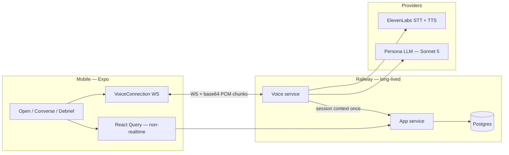

# Architecture — LingoAI / gotalkai

Living overview of how the system is designed to work. Product intent lives in [`PRD.md`](./PRD.md); decisions that changed the plan live in [`docs/adr/`](./docs/adr/). This doc is the map between them and the codebase.

**Status today (2026-07-30):** Product UI loop, app service, and voice-service pipeline modules are substantially built. The **shipped Converse screen still runs the scripted demo** (`use-converse-session`); a live client hook and server orchestrator exist but are **not activated end-to-end on device** (ADR-0017). Formal STT/TTS bake-off was **skipped**; vendors locked to ElevenLabs (ADR-0013). Sections below mark *current* vs *target* where they differ.

---

## 1. Context

Russian speaking-practice mobile app: AI personas with memory and calibrated difficulty. The learner talks; the product is a conversation partner, not a drill UI.

Core interaction is a **persistent bidirectional audio/control stream**, not request/response chat. Everything else (profile, cast map, debrief history) is ordinary HTTP + React Query.



---

## 2. Design principles

| Principle | Implication |
| --- | --- |
| Cascaded pipeline, not speech-to-speech | Product needs STT confidence signals, phoneme timings, and text-before-speech for recasts / register / repair |
| Two services from day one | Voice can move to Python/Pipecat later without rewriting auth, memory, or debrief |
| Long-lived processes only | Cold starts exceed the latency budget; warm provider connections must stick |
| Region before database | Pin voice near STT/TTS/LLM (typically US-East). Wrong region costs more than DB RTT |
| Voice has zero DB mid-turn | Assemble context at session start. A Postgres query between turns is a bug |
| Keys never in the bundle | Backend proxy / per-session credentials — never bake shared secrets into the mobile app |
| Zod at untrusted boundaries only | Persona LLM output, client↔server API, env at boot — not ORM↔Postgres (ADR-0007) |

---

## 3. Components

### 3.1 Mobile client (*current*)

**Stack:** Obytes Expo scaffold in `mobile/` (Expo SDK 54, Expo Router, Zustand + MMKV, React Query, TanStack Form + Zod, Uniwind/NativeWind, EAS). App version in `mobile/package.json` (currently **0.1.31**).

**Product surfaces present:** Open, Converse, Debrief, Tomorrow, cast / address book, onboarding / session-zero, settings, monthly benchmark route, plus debug screens. Template `feed` / `login` routes may still exist — not the product loop.

**Audio / stream groundwork:**

- `expo-audio` for open-mic metering (`use-mic-capture`) and TTS playback helper (`use-tts-playback`)
- `react-native-webrtc` local audio stream acquired on Converse for future AEC — **not** driving STT today (ADR-0017)
- `VoiceConnection` + `use-live-converse-session` built and unit-tested; **Converse screen still mounts `use-converse-session` (scripted)**

**Conversation screen is a special case.** Do not force React Query/axios onto the core loop. Own connection manager for the stream. React Query remains for profile, cast, debrief history, session start, learner flags.

**Hardware notes:**

- iOS audio session: `playAndRecord`-equivalent via `configureConverseAudioSession`; test routing on device
- Cyrillic font coverage including `ё` at scaffold-chip sizes
- Live raw-PCM frames into JS are **not available** with current deps (ADR-0017) — blocks triggering the server pipeline from the phone until a native capture path or WebRTC peer exists

### 3.2 App service (*current*)

Node/TypeScript under `app-service/`. Owns:

- Learner profile, onboarding flags (`cyrillic_literate`, translit derivation — ADR-0008)
- Persistence: sessions, turns, `learner_structures`, `persona_memories`, observations / debrief items, scenario selection, avoidance, benchmark, privacy/retention hooks
- Session start (daily cap — ADR-0006); HTTP APIs consumed by React Query
- Schema: `app-service/schema.sql`, applied via `pnpm db:migrate` / `applySchema`

**Still thin / missing for live Converse:** per-session voice-service credential minting (ADR-0017 blocker). `POST /sessions` returns session id without voice auth material.

### 3.3 Voice service (*current*)

Node/TypeScript under `voice-service/`. Owns:

- Authenticated WebSocket server (shared-secret placeholder today)
- Pipeline modules: VAD, ElevenLabs STT, persona LLM (Sonnet 5 + Zod), stress annotation, ElevenLabs TTS, turn orchestrator, safety detection, cost/tracing hooks
- Eval harness under `voice-service/src/eval/` (golden set, mechanical assertions, judge, canary)
- Persona definitions for Валентина and Елена (ADR-0023); default remains Валентина

**Not yet:** production dogfooding of the full cascade from a physical device through the shipped Converse UI.

### 3.4 Landing (*current*)

Next.js app under `landing/` for marketing (waitlist / explain product) — **not** a web Converse client. Hosted on Vercel (ticket #38).

### 3.5 Data store (*current* + target ops)

Postgres (local + Railway target). DDL in `app-service/schema.sql`.

**Irreplaceable:** `persona_memories`. Losing it resets every relationship. PITR required before relying on memories in production. Connection pooler + retention on high-volume `sessions` / `turns` still operational requirements.

Load-bearing tables:

| Table | Role |
| --- | --- |
| `learner_structures` | Engine: exposures, attempts, successes, avoidances, stability → scenario selection + debrief writes |
| `persona_memories` | Callback mechanic; never logged or traced |
| `observations` vs `debrief_items` | Keep all analyser notices; show three |
| `sessions` | Calibration used; correlate with abandonment; daily cap |
| `persona_world_state` | Renewable domestic life |

---

## 4. Voice pipeline

```
VAD → streaming STT → persona LLM → stress annotation → sentence-chunked TTS
```

Speech-to-speech is rejected: it hides STT confidence, phoneme timings (visemes), and editable text (recasts, register, repair dial).

### 4.1 Latency

**Target:** 700–900ms time-to-first-audio. Sub-250ms natural-conversation threshold is not expected with a cascade.

Buy-back:

- Stream every stage; never await complete results
- Sentence-boundary chunking into TTS
- In-character filler («ну…», «сейчас…») on end-of-turn to mask 300–500ms
- Prompt caching on persona identity/memory prefix (Sonnet cache minimum ~1024 tokens)

**Instrument six timestamps per turn** (turn-detect → first audio).

### 4.2 Persona LLM

[ADR-0003](./docs/adr/0003-persona-llm-claude-sonnet-5.md) + [ADR-0010](./docs/adr/0010-persona-llm-turn-generation.md): Claude Sonnet 5, `thinking` disabled, `effort` low/medium.

- Structured output constrained by Zod schema (same schema for runtime + eval)
- Mid-stream: parse early fields (`comprehension`, `affect`) for face reactivity
- Stream close: full Zod validate before anything reaches TTS
- Validation failure mid-conversation: in-character filler, log raw output, continue

### 4.3 Stress annotation

Russian-specific stage ([ADR-0015](./docs/adr/0015-stress-annotation-scope.md)). Under ElevenLabs (ADR-0013), stress control targets **IPA / SSML `<phoneme>` tags** (not only inline `+` / U+0301 as PRD §7.4 originally assumed). `ё` written explicitly.

### 4.4 Vendors (*current* — ADR-0013)

**Decision:** ElevenLabs for **both** STT and TTS; formal bake-off skipped under deadline pressure.

| PRD hard req | ElevenLabs outcome |
| --- | --- |
| STT word-level confidence | Met via per-word `logprob` (needs threshold calibration) |
| STT n-best alternatives | **Not met** — accepted; case/aspect-before-ASR-repair deferred |
| STT bill by audio duration | Met |
| TTS stress markers | Adapt to IPA phoneme tags (`eleven_v3` for non-English) |
| TTS phoneme / char timings | Met |
| TTS Unicode-codepoint billing | Met |

Ticket #13 remains open as a reminder the empirical bake-off never ran.

---

## 5. Turn-taking and hold-to-think

Hardest UX problem: B1 learners pause mid-sentence hunting for a word. Silence-threshold VAD cuts them off; that destroys trust.

- Patience timeout is a **per-level parameter** (repair dial in milliseconds)
- Pipecat SmartTurnDetection stays an option if Node turn detection fails
- Open mic for the whole session by default; push-to-talk is a setting with stated tradeoffs (kills backchanneling)

**Hold-to-think** ([ADR-0002](./docs/adr/0002-hold-to-think-requires-the-floor.md)):

- Meaning: *wait, I’m still going* — not “pause the session”
- While held **and learner has the floor:** suspend turn detection + mute STT
- During her turn, or before the learner has spoken: **no-op** (no queued-hold flag)
- **Auto-release ~45s** implemented in scripted and live session hooks

---

## 6. Client ↔ server boundaries

```
┌─────────────┐   HTTP (React Query)    ┌─────────────┐
│   Mobile    │ ───────────────────────►│ App service │──► Postgres
│             │   WebSocket + PCM       └──────┬──────┘
│  Converse   │ ◄─────────────────────────────►│
└─────────────┘                         ┌──────┴──────┐
                                        │Voice service│──► ElevenLabs / Sonnet
                                        └─────────────┘
```

**Target flow:**

1. App service authenticates learner, assembles session context, returns session handle + **voice endpoint credentials**.
2. Client opens WebSocket to voice service with that handle.
3. Voice service runs the cascade; posts turn artefacts / timings back through app service after turns or at session end — never queries DB mid-turn for persona state.
4. Debrief runs on app service when the session closes.

**Transport (*current*, ADR-0017):** audio as **base64 PCM chunks over WebSocket**, not a WebRTC `RTCPeerConnection`. Consequence: **no free AEC** on the path that would feed STT. WebRTC local stream from ticket #10 does not expose samples to JS for this protocol.

**Activation gap (*current*):** Converse UI uses scripted turns. Live hook is ready but blocked by (1) no live mic→PCM source in JS, (2) no per-session voice credentials from app service.

Zod validates persona LLM JSON and public HTTP payloads. Streaming caveat: incremental parse for early fields, full object validation before TTS.

---

## 7. Quality, cost, safety (architectural hooks)

| Concern | Hook |
| --- | --- |
| Eval | Golden set + mechanical assertions + judge under `voice-service/src/eval/` (ADR-0012); same Zod schema as production |
| Observability | Health vs quality split; tracing hooks (ADR-0022); canary runners present |
| Cost | TTS largest line; prompt caching; VAD-gated STT; short turns; **daily session cap** (ADR-0006) |
| Safety | Out-of-character escape hatch design (ADR-0019); safety detection in voice service; memories never in logs |
| Privacy | Deletion / sampling policy (ADR-0009); check biometric (e.g. BIPA) before storing voice |

---

## 8. Repository map (*current*)

| Path | Role |
| --- | --- |
| `mobile/` | Expo client — product loop UI + live Converse wiring (inactive on screen) |
| `app-service/` | HTTP API, Postgres schema/migrate, session/memory/debrief |
| `voice-service/` | Realtime WS + pipeline + eval harness |
| `landing/` | Next.js marketing site (Vercel) |
| `PRD.md` | Requirements and detailed tech rationale |
| `CHARACTER.md` | Persona / expression asset notes |
| `docs/adr/` | Accepted decisions (**0001–0024**) |
| `docs/agents/` | Tracker, triage, domain, versioning for agents |
| `memory-bank/` | Agent session continuity |
| `.cursor/rules/` | Review→commit, version bump, memory bank |

**Versioning:** bump `mobile/package.json` `"version"` (PATCH per completed ticket/feature). **Never** a separate root `VERSION` file — delete if it reappears; source of truth is `mobile/package.json` only.

**Phasing (PRD §15, adjusted by build reality):**

1. **Phase 1 slice** — pipeline modules + vendor decision (bake-off skipped) + dogfooding once device path works  
2. **Phase 2 loop** — screens + memory + debrief + scenario + session cap (largely coded; live Converse activation still open)  
3. **Phase 3** — observability, canary, cost, safety, privacy, PITR  
4. **Phase 4** — Rive face, second persona polish, text path, heritage calibration (ADRs 0021 / 0023 / 0024)

See [ADR-0001](./docs/adr/0001-skip-wizard-of-oz-build-demo-directly.md).

---

## 9. Related docs

- [`PRD.md`](./PRD.md) — §§7–12 (architecture, data, economics, QA, observability, safety)
- [`docs/adr/`](./docs/adr/) — especially 0001–0003 (founding), 0013 (vendors), 0017 (live Converse / transport)
- [`memory-bank/systemPatterns.md`](./memory-bank/systemPatterns.md) — condensed patterns for agents
- [`mobile/claude.md`](./mobile/claude.md) — Expo scaffold conventions
- [`app-service/README.md`](./app-service/README.md) / [`voice-service/README.md`](./voice-service/README.md) — local run
