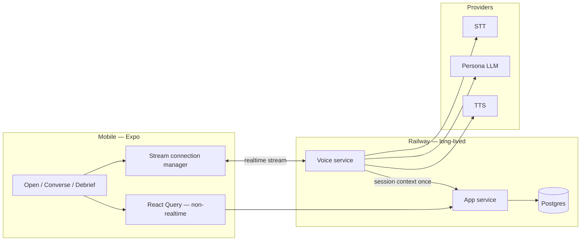

# Architecture — LingoAI / gotalkai

Living overview of how the system is designed to work. Product intent lives in [`PRD.md`](./PRD.md); decisions that changed the plan live in [`docs/adr/`](./docs/adr/). This doc is the map between them and the codebase.

**Status today:** client scaffold exists under `mobile/`; app/voice services and the realtime pipeline are not implemented yet. Sections below describe the **target** architecture unless marked *current*.

---

## 1. Context

Russian speaking-practice mobile app: one AI persona with memory and calibrated difficulty. The learner talks; the product is a conversation partner, not a drill UI.

Core interaction is a **persistent bidirectional audio/control stream**, not request/response chat. Everything else (profile, cast map, debrief history) is ordinary HTTP + React Query.



---

## 2. Design principles

| Principle | Implication |
| --- | --- |
| Cascaded pipeline, not speech-to-speech | Product needs STT confidence, phoneme timings, and text-before-speech for recasts / register / repair |
| Two services from day one | Voice can move to Python/Pipecat later without rewriting auth, memory, or debrief |
| Long-lived processes only | Cold starts exceed the latency budget; warm provider connections must stick |
| Region before database | Pin voice near STT/TTS/LLM (typically US-East). Wrong region costs more than DB RTT |
| Voice has zero DB mid-turn | Assemble context at session start. A Postgres query between turns is a bug |
| Keys never in the bundle | Backend proxy from Phase 1 |
| Zod at untrusted boundaries only | Persona LLM output, client↔server API, env at boot — not ORM↔Postgres |

---

## 3. Components

### 3.1 Mobile client (*current* + target)

**Current:** Obytes Expo scaffold in `mobile/` (Expo SDK 54, Expo Router, Zustand + MMKV, React Query, TanStack Form + Zod, Uniwind/NativeWind, EAS). Design tokens foundation landed; template feed/auth demo still present.

**Target additions:**

- `expo-audio` (not deprecated `expo-av`)
- `react-native-webrtc` for AEC (echo cancellation is non-negotiable)
- EAS **development builds** from day one — Expo Go cannot run the native audio/WebRTC stack
- Later: Rive runtime for the face (v2); dialogue layer must already emit `comprehension` + `affect`

**Conversation screen is a special case.** Do not force React Query/axios onto the core loop. Own connection manager for the stream. React Query remains for profile, cast map, debrief history.

**Hardware notes the template does not solve:**

- iOS audio session: `playAndRecord` with correct options; test routing on device
- Cyrillic font coverage including `ё` at scaffold-chip sizes

### 3.2 App service (planned)

Node/TypeScript. Owns:

- Auth, learner profile, onboarding flags (`cyrillic_literate`, translit)
- Persistence: sessions, turns, `learner_structures`, `persona_memories`, observations / debrief items
- Session assembly (persona memories, structures, scenario) **before** audio streams
- Debrief analysis and tomorrow’s scenario selection
- HTTP APIs consumed by React Query

### 3.3 Voice service (planned)

Node/TypeScript initially; realtime only. Owns:

- Bidirectional stream with the client
- Pipeline orchestration: hold-to-talk (press/release) → STT → LLM → stress annotation → TTS
- Stage timing instrumentation (six timestamps per turn)
- **No mid-conversation database access** — receives frozen context at session start

Turn detection was originally VAD-based, with a hold-to-think override (see §5) and a split
designed so detection could move to Python + Pipecat without touching the app service. Both are
gone (ticket #40, PRD §7.9): a real-device echo/false-interruption failure with no acoustic echo
cancellation on the open mic led to replacing VAD with the client's hold-to-talk button — press
and hold to talk, release to send. See PRD §6.2/§7.9/§7.10 and risk 10 (§14) for the full
reasoning and the tradeoff (backchanneling and barge-in no longer work).

### 3.4 Data store (planned)

Railway Postgres for v1 (one platform). Alternatives if backup/PITR is thin: Neon (branching for eval) or Supabase (only if adopting its auth/storage).

**Irreplaceable:** `persona_memories`. Losing it resets every relationship. PITR is required before Phase 3. `sessions` / `turns` are high volume — retention policy from day one. Connection pooler required.

Full DDL intended in `schema.sql` (not yet in repo). Load-bearing tables:

| Table | Role |
| --- | --- |
| `learner_structures` | Engine: exposures, attempts, successes, avoidances, stability → scenario selection + debrief writes |
| `persona_memories` | Callback mechanic; never logged or traced |
| `observations` vs `debrief_items` | Keep all analyser notices; show three |
| `sessions` | Calibration used; correlate with abandonment |
| `persona_world_state` | Renewable domestic life (add early even if empty) |

---

## 4. Voice pipeline

```
hold-to-talk (press/release) → streaming STT → persona LLM → stress annotation → sentence-chunked TTS
```

Speech-to-speech is rejected: it hides STT confidence (“she doesn’t understand you”), phoneme timings (visemes), and editable text (recasts, register, repair dial).

### 4.1 Latency

**Target:** 700–900ms time-to-first-audio. Sub-250ms natural-conversation threshold is not expected with a cascade.

Buy-back:

- Stream every stage; never await complete results
- Sentence-boundary chunking into TTS
- In-character filler («ну…», «сейчас…») on end-of-turn to mask 300–500ms
- Prompt caching on persona identity/memory prefix (Sonnet cache minimum ~1024 tokens)

**Instrument six timestamps per turn** (turn-detect → first audio). One duration number cannot locate a regression.

### 4.2 Persona LLM

[ADR-0003](./docs/adr/0003-persona-llm-claude-sonnet-5.md): Claude Sonnet 5, `thinking` disabled, `effort` low/medium.

- Structured output constrained by Zod schema (same schema for runtime + eval)
- Mid-stream: parse early fields (`comprehension`, `affect`) for face reactivity
- Stream close: full Zod validate before anything reaches TTS
- Validation failure mid-conversation: in-character filler («простите, что-то я задумалась»), log raw output, continue — Phase 1 requirement

### 4.3 Stress annotation

Russian-specific stage. Runtime-generated lines are never hand-checked; mis-stress teaches the wrong form.

- Dictionary for high-frequency core; RUAccent-class model for the tail
- Emit `+` or U+0301 into TTS input
- Write `ё` explicitly

### 4.4 Vendors (provisional until Phase 1 bake-off)

Build to **hard requirements**, not a locked SDK.

**STT must:**

- Word-level confidence + n-best (confidence mechanic + case errors before ASR repair)
- Bill by **audio duration**, not connection time (hold-to-talk naturally bounds this to the held duration — see §5)

**TTS must:**

- Explicit stress markers
- Phoneme timings / character alignment (visemes)
- Per-Unicode-codepoint billing (Cyrillic is 2 UTF-8 bytes)

**Provisional:** STT → Deepgram; TTS → Azure Neural vs ElevenLabs Turbo bake-off.

---

## 5. Turn-taking: hold-to-talk

**Revised (ticket #40, PRD §7.9).** Originally open-mic + silence-threshold VAD, with a
hold-to-think override ([ADR-0002](./docs/adr/0002-hold-to-think-requires-the-floor.md)) for B1
learners pausing mid-sentence — VAD cutting them off destroyed trust, and per-level timeouts /
Pipecat SmartTurnDetection were both being considered to soften that. Reversed after a real-device
failure: with no acoustic echo cancellation on the open mic, her own TTS audio re-entering the mic
read as a genuine interruption, cancelling her audio before it played and locking sessions into a
silent fallback loop.

- **Press and hold to talk; release to send.** Release is the turn boundary — no VAD, no
  threshold, no hold-to-think (there's no open mic left to pause).
- **Button disabled while she's speaking or generating a reply.**
- **This also resolves the hesitant-learner problem by construction**, not mitigation — the
  learner controls exactly how long they hold, so there's no threshold to cut them off early.
- **Cost, stated plainly:** backchanneling and barge-in no longer work. See PRD §5.6/§7.10 and risk
  10 (§14) — `react-native-webrtc`'s AEC path (already built for the scripted demo, not wired to
  the live pipeline) is a possible way to bring the open mic back later.

---

## 6. Client ↔ server boundaries

```
┌─────────────┐   HTTP (React Query)    ┌─────────────┐
│   Mobile    │ ───────────────────────►│ App service │──► Postgres
│             │   WS/WebRTC stream      └──────┬──────┘
│  Converse   │ ◄─────────────────────────────►│
└─────────────┘                         ┌──────┴──────┐
                                        │Voice service│──► STT / LLM / TTS
                                        └─────────────┘
```

1. App service authenticates learner, assembles session context, returns session handle + voice endpoint credentials.
2. Client opens realtime stream to voice service with that handle.
3. Voice service runs the cascade; posts turn artefacts / timings back through app service **after** turns or at session end — never queries DB mid-turn for persona state.
4. Debrief runs on app service when the session closes.

Zod validates persona LLM JSON and public HTTP payloads. Streaming caveat: incremental parse for early fields, full object validation before TTS.

---

## 7. Quality, cost, safety (architectural hooks)

| Concern | Hook |
| --- | --- |
| Eval | Golden set + mechanical assertions + judge; same Zod schema as production (`eval/` planned) |
| Observability | Health (pages) vs quality (sampled, never pages); canary golden cases against live endpoint; one trace per session, span per turn |
| Cost | TTS largest line; prompt caching; hold-to-talk-bounded STT; short turns; **daily session cap** |
| Safety | Out-of-character escape hatch before launch (distress + sexualisation); sample audio 2–5% with separate consent; memories never in logs |
| Privacy | Deletion clears memories + audio + transcripts together; check biometric (e.g. BIPA) before storing voice |

---

## 8. Repository map (*current*)

| Path | Role |
| --- | --- |
| `mobile/` | Expo client (only runnable product code today) |
| `PRD.md` | Requirements and detailed tech rationale |
| `docs/adr/` | Accepted decisions (WoZ skip, hold-to-think, persona LLM) |
| `docs/agents/` | Tracker, triage, domain, versioning for agents |
| `memory-bank/` | Agent session continuity |
| `.cursor/rules/` | Review→commit, version bump, memory bank |

**Versioning:** bump `mobile/package.json` `"version"` (PATCH per completed ticket/feature). Never a separate `VERSION` file.

**Phasing:** Phase 1 = pipeline slice + bake-off + dogfooding; Phase 2 = three screens + memory + eval CI; Phase 3 = production readiness; Phase 4 = face / second persona / text path. See PRD §15 and [ADR-0001](./docs/adr/0001-skip-wizard-of-oz-build-demo-directly.md).

---

## 9. Related docs

- [`PRD.md`](./PRD.md) — §§7–12 (architecture, data, economics, QA, observability, safety)
- [`docs/adr/0001-skip-wizard-of-oz-build-demo-directly.md`](./docs/adr/0001-skip-wizard-of-oz-build-demo-directly.md)
- [`docs/adr/0002-hold-to-think-requires-the-floor.md`](./docs/adr/0002-hold-to-think-requires-the-floor.md)
- [`docs/adr/0003-persona-llm-claude-sonnet-5.md`](./docs/adr/0003-persona-llm-claude-sonnet-5.md)
- [`memory-bank/systemPatterns.md`](./memory-bank/systemPatterns.md) — condensed patterns for agents
- [`mobile/claude.md`](./mobile/claude.md) — Expo scaffold conventions
